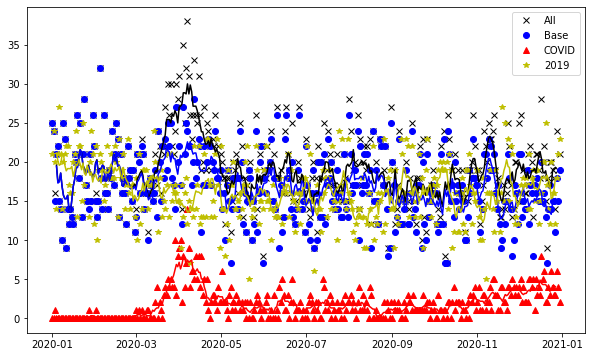
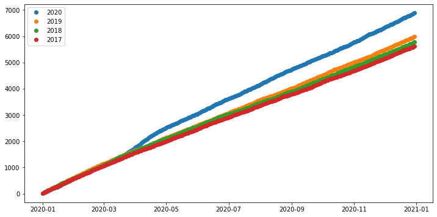
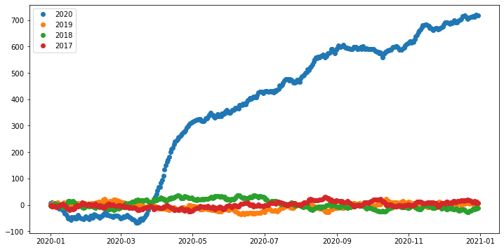
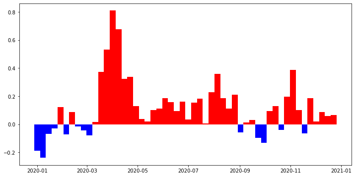
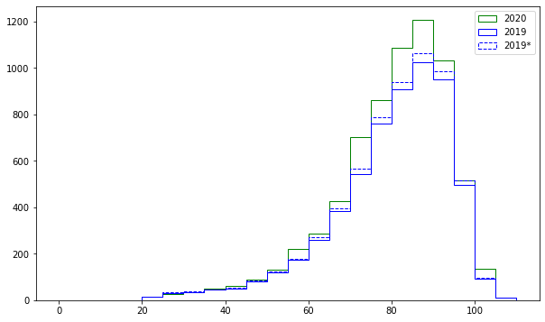

# Necropedia: Analysis of Wikipedia data for estimating COVID-19 fatality in 2020

Author: Maxim Razin\
Date: 2021-01-04\
*Draft*

### Idea

Find an independent source of information on COVID-19 fatality rate by data mining Wikipedia articles. With all the limitations and biases of the Wikipedia corpus, it still might serve as a verification of our intuition.

### Fetching data

We scan the English Wikipedia category "\<Year\> Deaths" and retrieve all the articles. Each article is parsed in order to fetch the person's birth and death dates; the articles that are created after the person's death are ignored in order to avoid the newsworthliness bias (as the death itself might be a trigger for the article creation). Also we try to determine if the person's death is related to COVID-19 by searching keywords "COVID" and "coronavirus" in the article.

This approach is inexact, mostly because some articles are ill-formed and the robot fails to fetch the data, but as the same methodology is used for the baseline corpus of persons who died in 2017-2019, we assume that it's good enough.

### Analysis

In total 6882 death records found in Wikipedia, of which 682 (9.9%) are explicitly mentioning COVID (we assume that it means that COVID was the reason of deaths of the person).

Fig. 1 shows the number of deaths per day of 2020, compared to the corresponding date of 2019, with a 7 day moving average.

\
*Fig 1. Daily mortality in 2020. Black is for all the 2020 deaths, red is for COVID deaths, blue is for the non-COVID deaths, and yellow is the 2019 baseline.*

We see the epidemic onset in March, peak in April and long tail afterwards which never reaches the April peak values.

It is still possible that the "COVID" labeling is incomplete, for better analysis, we'll try to average the 2017-2019 data for the baseline.

\
*Fig 2. Cumulative death count in 2017-2020*

As we see, the lines of 2017-2019 don't match well, which can be attributed to the corpus growth. To compensate, let's assume linear growth (which is good enough, as at the scale of a few percent linear growth is indistinguishable from exponential). Subtracting the average of 2017-2019, we get the following Fig 3.

\
*Fig 3. Cumulative excess deaths of 2020 comparing to average 2017-2019, factored corpus growth*

This gives some overall picture: 2020 started with unusually low fatality, late March and early April were especially bad, and after that roughly constant excess death rate. There is no obvious second/third/whatever wave. The weekly excess deaths diagram is at Fig. 4.

\
*Fig. 4. Weekly excess deaths*

The expected number of deaths in 2020 given the linear growth would be 6163, i.e. we see 11.6% excess deaths which is very close to the number of "labeled" deaths (11.0%)—there is no evidence of "hidden" COVID fatality, at least within the corpus.

Next question to investigate is the age distribution of the deaths. It is common knowledge that COVID-19 is especially deadly for the elderly population, so we should expect the older people to be disproportionately affected. In reality (Fig. 5) significant excess (probably) starts in the 55-60 year cohort, and the 70-90 year old are more affected than the older people, but it might be a statistical fluctuation. On average the people dying of COVID are ~4 years younger than those dying of other reasons.

\
*Fig. 5. Age distribution at death in 2020 vs 2019. The dashed line is correction for the corpus growth*

### Known biases

The author is aware of representation biases of the corpus.
Geographically Western Europe and North America are probably overrepresented. Older persons are more likely to be represented as they probably have more achievements eligible for the Wikipedia article; there might be lots of other biases, including but not limited to gender, education, native language etc.

### Further ideas

1. Expand the methodology for longer time scale, looking for other mass fatality events, such as epidemics and wars.

2. Treat the age bias of the Wikipedia corpus (older persons are probably overrepresented) by factoring the relative representation of different birth date.

3. Try to extract geography information from the articles to get some geography distribution of the epidemic.

4. Better statistical analysis.

## Code
https://github.com/grep0/necropedia
